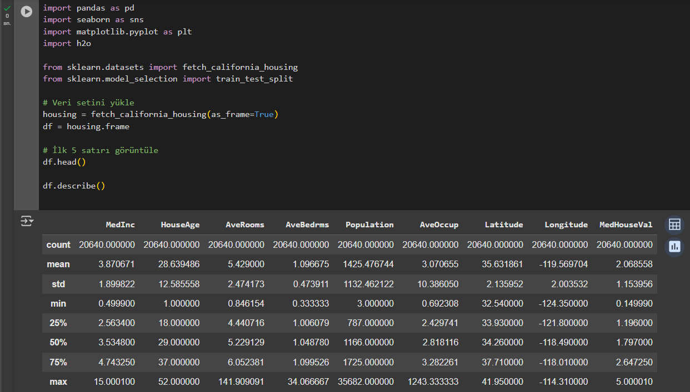
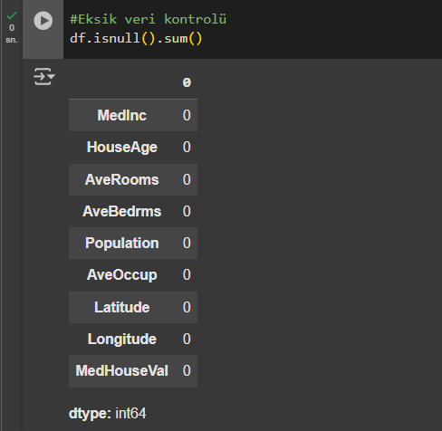
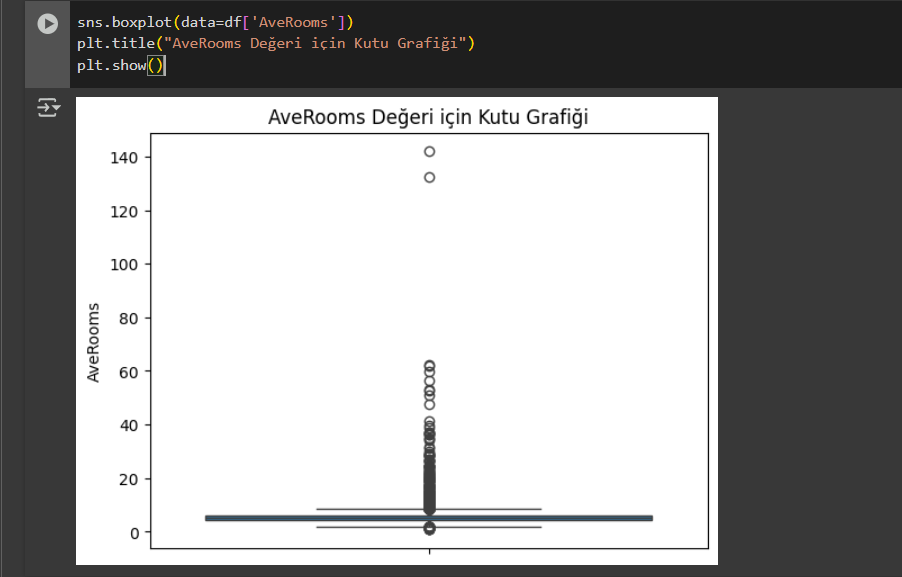
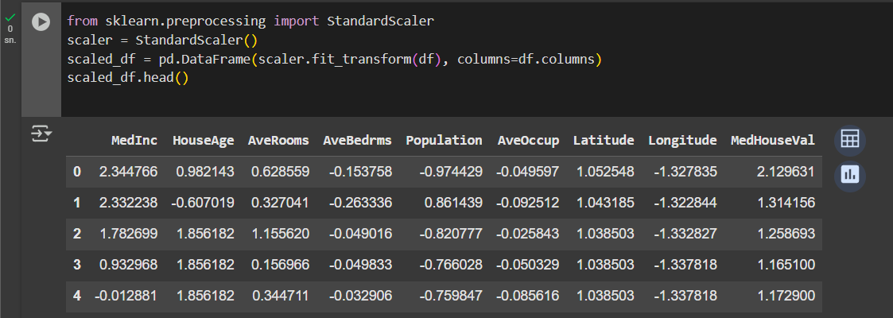
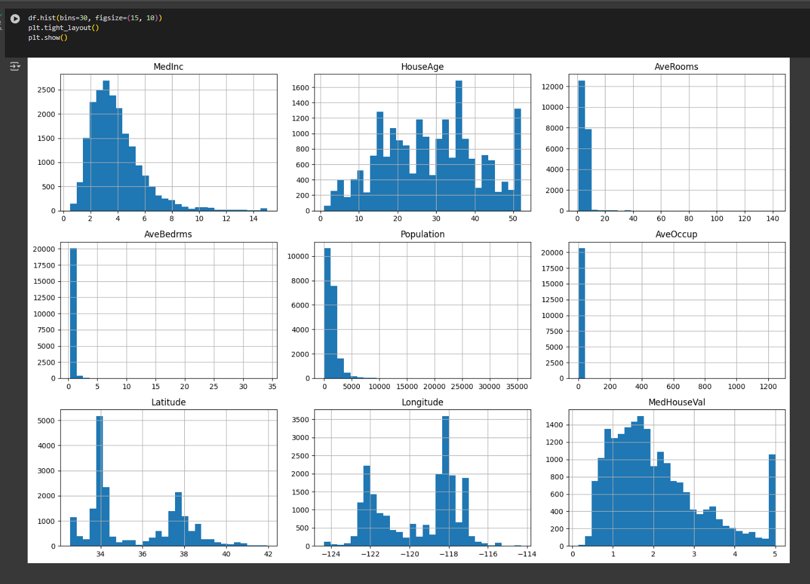
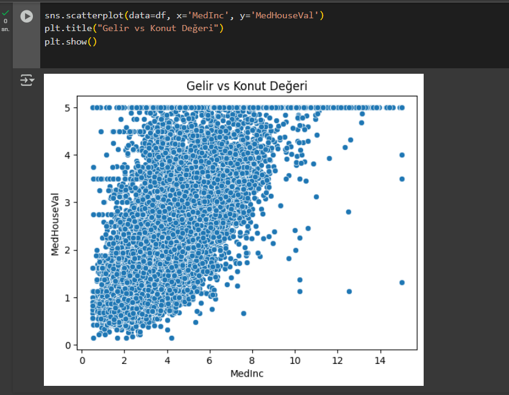
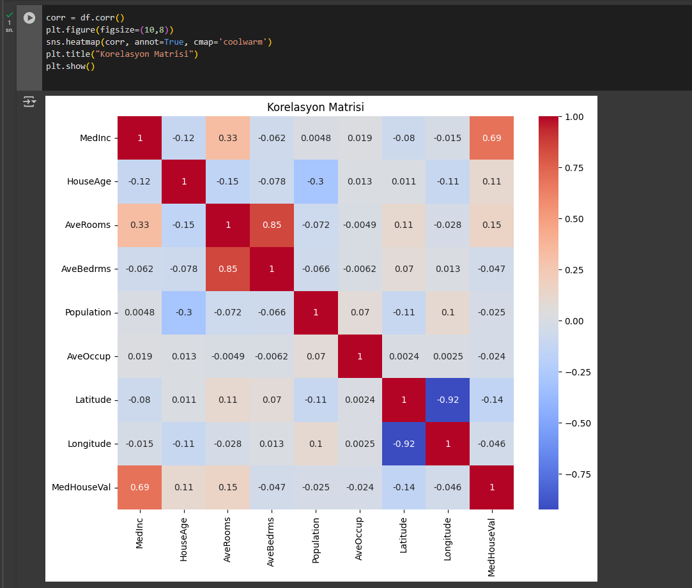

# YMT5270 Final Sınav Projesi: H2O ile Veri Analizi ve Makine Öğrenmesi

## Öğrenci Bilgileri
- **Ad Soyad**: Nebahat Beyza Akkılıç
- **Öğrenci Numarası**: 241137102
- **E-posta**: akkilicbeyza@gmail.com

## Proje Özeti
> *Bu bölümde projenizin genel bir özetini yazınız. Hangi veri setini neden seçtiğinizi, hangi analiz yöntemlerini uyguladığınızı ve genel sonuçlarınızı kısaca açıklayınız (150-250 kelime).*

## Veri Seti
### Veri Seti Bilgileri
- **Veri Seti Adı**: California Housing Dataset
- **Kaynak**: [Veri Seti Bağlantısı](https://scikit-learn.org/stable/datasets/real_world.html#california-housing-dataset)
- **Lisans**: Public Domain (ABD hükümeti tarafından sağlanmıştır, açık ve ücretsiz kullanıma uygundur.)
- **Veri Seti Boyutu**: 20.640 satır, 9 sütun

### Veri Seti Tanımı
> *California Housing veri seti, 1990 ABD Nüfus Sayımı'na dayalı olarak California eyaletindeki konut bölgelerinden toplanmış verilerdir. Her satır, belirli bir bölgedeki konut özelliklerini ve hedef değişken olarak medyan konut değerini (median_house_value) temsil eder. Bu veri seti, konut fiyatlarını tahmin etmeye yönelik regresyon problemleri için kullanılır.*
>
> *Veri, aşağıdaki bilgileri içermektedir: bölgedeki ortalama gelir, ortalama yaş, konut yoğunluğu, nüfus, ev başına oda sayısı gibi demografik ve fiziksel değişkenler. Veriler, birden fazla özniteliğe sahiptir ve öznitelikler arasında yüksek korelasyonlar olabilir.*
>
> *Sınırlılıklar: Veriler 1990 yılına ait olduğundan, günümüz koşullarını tam olarak yansıtmayabilir. Ayrıca coğrafi konum koordinatları sadece California'ya aittir.*

### Öznitelik Açıklamaları
| Öznitelik Adı        | Veri Tipi | Açıklama                                                                 |
|----------------------|-----------|--------------------------------------------------------------------------|
| `MedInc`             | Sayısal   | Hane halkı başına ortalama gelir (10,000$ cinsinden)                    |
| `HouseAge`           | Sayısal   | Konutların ortalama yaşı (yıl)                                          |
| `AveRooms`           | Sayısal   | Ortalama toplam oda sayısı                                             |
| `AveBedrms`          | Sayısal   | Ortalama yatak odası sayısı                                            |
| `Population`         | Sayısal   | Bölgedeki toplam nüfus                                                 |
| `AveOccup`           | Sayısal   | Hane başına ortalama kişi sayısı                                       |
| `Latitude`           | Sayısal   | Enlem (coğrafi koordinat)                                              |
| `Longitude`          | Sayısal   | Boylam (coğrafi koordinat)                                             |
| `MedHouseVal`        | Sayısal   | Hedef değişken: Bölgedeki medyan konut değeri (100,000$ cinsinden)     |

✅ Bu veri setinde tüm değişkenler sayısaldır ve hedef değişken: MedHouseVal’dir.

## Keşifsel Veri Analizi (Explanatory Data Analysis - EDA)
### Temel İstatistikler
> *Aşağıdaki tablo, veri setinde yer alan özniteliklere ilişkin temel istatistikleri (ortalama, medyan, minimum, maksimum, standart sapma vb.) göstermektedir. Bu bilgiler, veri setinin dağılımı hakkında genel bir fikir verir. Örneğin, ortalama gelir (MedInc) 3.87 birim iken, konutların ortalama yaşı (HouseAge) 28.64 yıldır. Medyan konut değeri (MedHouseVal) ise yaklaşık 2.07 birim civarındadır (100,000$ cinsinden). Bu değerler modelleme için hedef değişkenin yeterli varyansa sahip olduğunu göstermektedir.*
> 
>

### Veri Ön İşleme
> *Veri setinize uyguladığınız ön işleme adımlarını detaylandırınız:*
> - *Veri setinde eksik değer bulunmamaktadır. Bu durum, model eğitimi öncesi veri temizliği açısından avantaj sağlar.*
> 
> 
> - *Aykırı değer analizi sonucu bazı değişkenlerde (örneğin AveRooms) uç değerler gözlemlenmiştir. Ancak, bu değerler veri setinin doğası gereği oluşmuş olabilir, bu nedenle dışlanmamıştır.*
>
> 
> - *Tüm sayısal öznitelikler StandardScaler kullanılarak ölçeklendirilmiştir. Bu adım, özellikle regresyon algoritmalarının daha etkili çalışmasını sağlamak için uygulanmıştır.*
>
> 

### Görselleştirmeler
> *Aşağıda veri setindeki özniteliklerin dağılımlarını gösteren histogramlar yer almaktadır. Örneğin, MedInc verisinin sağa çarpık bir dağılım gösterdiği görülmektedir.*
>
> 
>
> *Ayrıca, MedInc (gelir) ile MedHouseVal (konut değeri) arasında pozitif yönlü bir ilişki bulunmaktadır. Bu da yüksek gelirli bölgelerde konut değerlerinin daha yüksek olduğunu göstermektedir.*
>
> 

### Öznitelik İlişkileri
> *Aşağıdaki korelasyon matrisi, öznitelikler arasındaki ilişkileri göstermektedir. MedInc ile MedHouseVal arasında 0.69 gibi yüksek pozitif bir korelasyon bulunmaktadır. Bu, gelirin konut değeri üzerinde önemli bir etkisi olabileceğini gösterir. Benzer şekilde AveRooms ve HouseAge gibi değişkenlerin de konut değerleri ile belirli ilişkileri mevcuttur.*
>
> 

## Makine Öğrenmesi Uygulaması
### Kullanılan Yöntem
> *Bu projede, H2O.ai platformunun sağladığı AutoML (Automated Machine Learning) özelliği kullanılarak regresyon modelleri eğitilmiştir. AutoML, farklı makine öğrenmesi algoritmalarını otomatik olarak deneyerek en iyi performansı gösteren modeli belirler. Eğitim işlemi sırasında kullanılan bazı önemli ayarlar ve parametreler aşağıda belirtilmiştir:*

### Modeller ve Parametreler
> - *Eğitim Veri Seti (training_frame): california_housing.hex*
> - Hedef Değişken (response_column): MedHouseVal (bölgedeki medyan konut değeri)
> - Doğrulama Veri Seti (validation_frame): california_housing.hex
> - Blending Frame: california_housing.hex (Stacked Ensemble algoritması için kullanıldı)
> - Leaderboard Frame: california_housing.hex (modellerin karşılaştırılması için kullanıldı)
> - Proje Adı (project_name): california_housing_ml
> - Dağılım (distribution): AUTO (H2O otomatik olarak uygun dağılımı seçmiştir)*
>
> *AutoML süreci sonucunda GBM (Gradient Boosting Machine), Random Forest, GLM (Generalized Linear Model), XGBoost ve Stacked Ensemble gibi farklı algoritmalar değerlendirilmiştir. En yüksek performansı sağlayan model, StackedEnsemble_AllModels_AutoML olarak seçilmiştir.*

### Model Değerlendirmesi
> *Uyguladığınız modelin performansını değerlendiriniz. Kullandığınız değerlendirme metriklerini açıklayınız.*

#### Metrikler
| Metrik | Değer |
|--------|-------|
| Örnek Metrik 1 | 0.85 |
| Örnek Metrik 2 | 0.78 |
| ... | ... |

### Sonuçların Yorumlanması
> *Elde ettiğiniz sonuçları detaylı bir şekilde yorumlayınız. Modelin güçlü ve zayıf yönleri nelerdir? Başka hangi modeller denenebilirdi?*

## Sonuç ve Öneriler
> *Projenizin genel bir değerlendirmesini yapınız. Elde ettiğiniz sonuçlar hakkında çıkarımlarınızı ve gelecek çalışmalar için önerilerinizi yazınız.*

## Kaynaklar
> *Proje boyunca yararlandığınız kaynakları (makaleler, web siteleri, videolar, vb.) buraya ekleyiniz.*

1. Kaynak 1
2. Kaynak 2
3. ...

## Ekler
### ipynb Proje Dosyası
> * proje dosyanızı (.ipynb) bu repoya yükleyiniz ve buradan referans veriniz.*

### Veri Seti Dosyası veya Bağlantısı
> *Kullandığınız veri setini bu repoya yükleyebilir veya bağlantısını burada paylaşabilirsiniz.*
>
> [Veri_Seti.csv](veri_seti.csv) veya [Veri Seti Bağlantısı](https://ornek-veri-seti-baglantisi.com)
